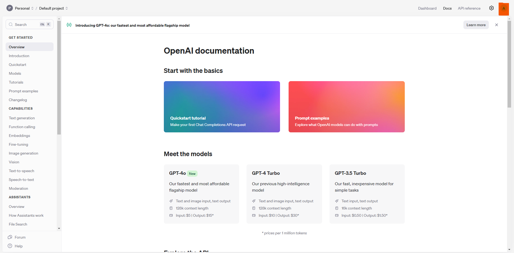
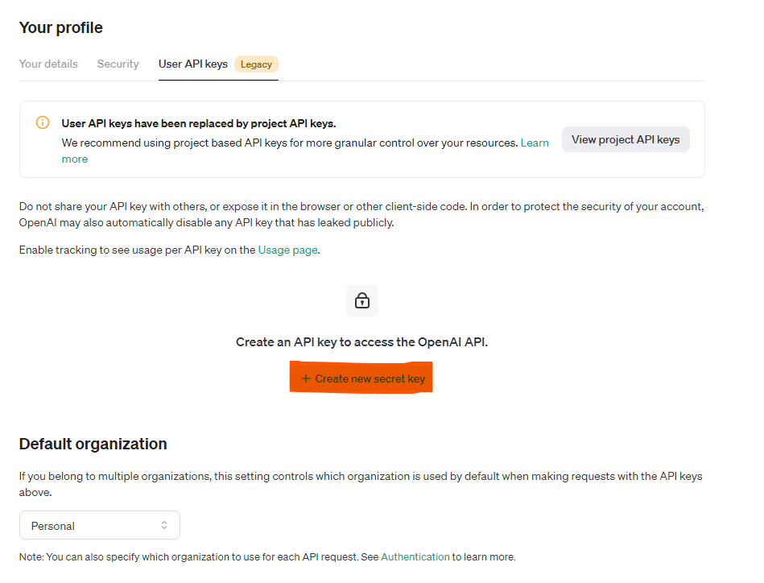

# General Description of OpenAI api
Although ChatGPT is free, OpenAI API, depends on what functionality, model, input/output do take [prices](https://openai.com/api/pricing/).

# Obtaining API Keys

We need an API keys to access the model. 
1. The API keys can be obtained by login to [OpenAI official website](https://openai.com/) and click the user icon as highlighted


2. Click the User profile.


3. Click Create new secret key.


# Using Python

Detailed description of the [library](https://platform.openai.com/docs/libraries/python-library) and available [models](https://platform.openai.com/docs/models) can be found in their official website. 

## Template 1

Standard example of how to use the api.

```python
!pip install openai #install library

import openai
openai.api_key = 'apikey'

response = openai.Completion.create(
    model="text-davinci-003", # Select a [model](https://platform.openai.com/docs/models)
    prompt="Sample prompt", # "Send" a request
    max_tokens=128,
    temperature=0.5, # Randomless of the response, range from 0 to 1. 0 implies more stable result; 1 implies a more unexpected result 
)

completed_text = response["choices"][0]["text"]
print(completed_text)
```

Another example using gpt would be

```python
message=[
    {"role": "system", "content": "Enter what and how the AI respond to you"},
    {"role": "assistant", "content": "Guide or hints AI to reply"},
    {"role": "user", "content": "User message"}
  ]
completion = client.chat.completions.create(
  model="gpt-3.5-turbo",
  messages=message
)
feedback=completion.choices[0].message
print(feedback)
```

Note that we can always append new message to ask for return a new feedback.

## Template 2

An example using api to make chatgpt

```python

import openai
openai.api_key = 'apikey'

while True:
    msg = input()
    response = openai.Completion.create(
        model='text-davinci-003',
        prompt=msg,
        max_tokens=128,
        temperature=0.5
    )

    completed_text = response['choices'][0]['text']
    print(completed_text)

```